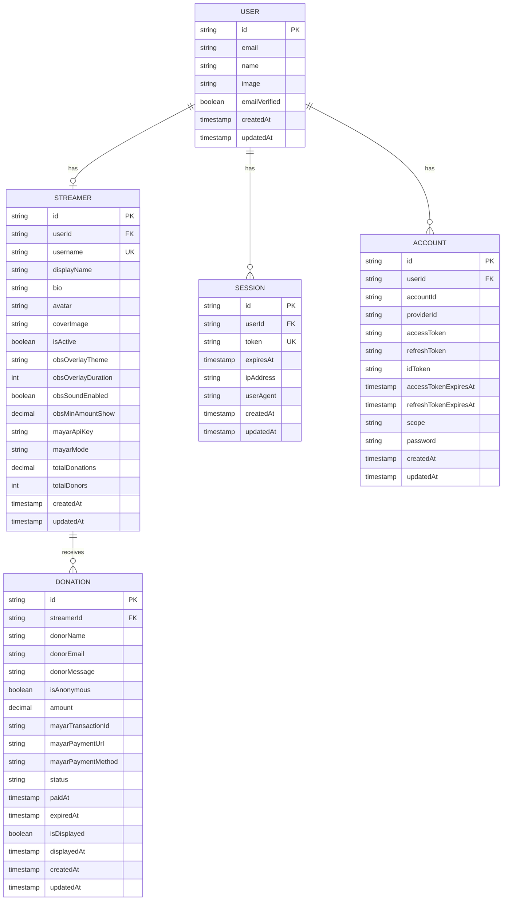

# 🗄️ Database Schema

Dokumentasi lengkap skema database Sawitea.

## 📊 Entity Relationship Diagram



## 📋 Tables

### User & Authentication

#### `user`
Tabel utama untuk autentikasi (managed by Better Auth).

| Column | Type | Description |
|--------|------|-------------|
| id | text (PK) | UUID user |
| name | text | Nama lengkap |
| email | text (UK) | Email address |
| emailVerified | boolean | Status verifikasi email |
| image | text | URL avatar |
| createdAt | timestamp | Waktu pembuatan |
| updatedAt | timestamp | Waktu update |

#### `session`
Session aktif user (managed by Better Auth).

| Column | Type | Description |
|--------|------|-------------|
| id | text (PK) | UUID session |
| userId | text (FK) | Reference ke user |
| token | text (UK) | Session token |
| expiresAt | timestamp | Expiry time |
| ipAddress | text | IP address |
| userAgent | text | Browser user agent |
| createdAt | timestamp | Waktu pembuatan |
| updatedAt | timestamp | Waktu update |

#### `account`
OAuth accounts (managed by Better Auth).

| Column | Type | Description |
|--------|------|-------------|
| id | text (PK) | UUID account |
| userId | text (FK) | Reference ke user |
| accountId | text | Provider account ID |
| providerId | text | OAuth provider (google, github) |
| accessToken | text | OAuth access token |
| refreshToken | text | OAuth refresh token |
| idToken | text | OIDC ID token |
| accessTokenExpiresAt | timestamp | Token expiry |
| refreshTokenExpiresAt | timestamp | Refresh token expiry |
| scope | text | OAuth scope |
| password | text | For password auth |
| createdAt | timestamp | Waktu pembuatan |
| updatedAt | timestamp | Waktu update |

---

### Core Business Logic

#### `streamer`
Profil streamer yang menerima donasi.

| Column | Type | Description |
|--------|------|-------------|
| id | text (PK) | UUID streamer |
| userId | text (FK) | Reference ke user |
| username | text (UK) | Unique username |
| displayName | text | Nama tampilan |
| bio | text | Deskripsi streamer |
| avatar | text | URL avatar |
| coverImage | text | URL cover image |
| isActive | boolean | Status aktif |
| obsOverlayTheme | text | Tema OBS overlay |
| obsOverlayDuration | integer | Durasi tampilan (detik) |
| obsSoundEnabled | boolean | Suara notifikasi |
| obsMinAmountShow | decimal | Minimal amount untuk ditampilkan |
| mayarApiKey | text | API key Mayar (encrypted) |
| mayarMode | text | sandbox / production |
| totalDonations | decimal | Total donasi diterima |
| totalDonors | integer | Total jumlah donor |
| createdAt | timestamp | Waktu pembuatan |
| updatedAt | timestamp | Waktu update |

**Indexes:**
- `username` - Unique, untuk lookup cepat
- `userId` - Foreign key

#### `donation`
Record donasi dari donor.

| Column | Type | Description |
|--------|------|-------------|
| id | text (PK) | UUID donation |
| streamerId | text (FK) | Reference ke streamer |
| donorName | text | Nama donor |
| donorEmail | text | Email donor |
| donorMessage | text | Pesan donor |
| isAnonymous | boolean | Sembunyikan nama |
| amount | decimal | Jumlah donasi |
| mayarTransactionId | text | ID transaksi Mayar |
| mayarPaymentUrl | text | URL pembayaran Mayar |
| mayarPaymentMethod | text | Metode pembayaran aktual |
| status | enum | pending / completed / failed / expired |
| paidAt | timestamp | Waktu pembayaran |
| expiredAt | timestamp | Waktu kadaluarsa |
| isDisplayed | boolean | Sudah ditampilkan di OBS |
| displayedAt | timestamp | Waktu ditampilkan |
| createdAt | timestamp | Waktu pembuatan |
| updatedAt | timestamp | Waktu update |

**Indexes:**
- `streamerId` - Foreign key
- `status` - Untuk query by status
- `isDisplayed` - Untuk OBS queue
- `createdAt` - Sorting

---

## 🔗 Relationships

### One-to-One
- `user` ↔ `streamer`: Satu user memiliki satu profil streamer

### One-to-Many
- `user` → `session`: Satu user bisa memiliki banyak session
- `user` → `account`: Satu user bisa memiliki banyak OAuth account
- `streamer` → `donation`: Satu streamer bisa menerima banyak donasi

---

## 📈 Migrations

### Creating Migration

```bash
# Generate migration dari schema changes
cd packages/database
npm run db:generate

# Hasilnya akan ada di folder drizzle/
```

### Running Migration

```bash
# Push schema ke database
npm run db:push

# Atau dengan migrations (untuk production)
npm run db:migrate
```

### Drizzle Studio

```bash
# Buka GUI untuk manage database
npm run db:studio

# Buka: http://local.drizzle.studio
```

---

## 💾 TypeScript Types

```typescript
// packages/database/src/schema/donation.ts

export type Streamer = typeof streamer.$inferSelect;
export type NewStreamer = typeof streamer.$inferInsert;

export type Donation = typeof donation.$inferSelect;
export type NewDonation = typeof donation.$inferInsert;

// Usage
const newDonation: NewDonation = {
  streamerId: "...",
  donorName: "John",
  amount: "50000",
};
```

---

**Related:**
- [System Overview](./SYSTEM_OVERVIEW.md)
- [Getting Started](../guides/GETTING_STARTED.md)
