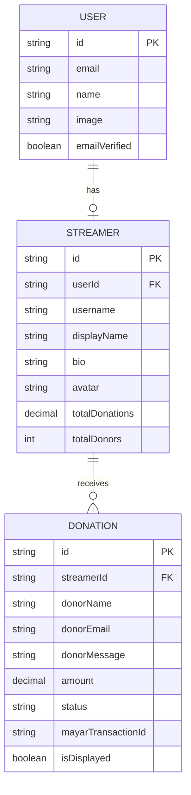

# 🏗️ System Architecture

Overview arsitektur sistem Sawitea.

## 📊 High-Level Architecture

```
┌─────────────────────────────────────────────────────────────┐
│                        Client Layer                         │
│  ┌──────────────┐  ┌──────────────┐  ┌──────────────┐      │
│  │   Browser    │  │  OBS Studio  │  │  Mobile App  │      │
│  │  (Next.js)   │  │  (Overlay)   │  │   (Future)   │      │
│  └──────┬───────┘  └──────┬───────┘  └──────┬───────┘      │
└─────────┼─────────────────┼─────────────────┼──────────────┘
          │                 │                 │
          └─────────────────┼─────────────────┘
                            │ HTTP / WebSocket
┌───────────────────────────┼─────────────────────────────────┐
│                      API Gateway                            │
│                   (NestJS 11 + Express)                     │
└───────────────────────────┬─────────────────────────────────┘
                            │
          ┌─────────────────┼─────────────────┐
          │                 │                 │
┌─────────▼────────┐ ┌──────▼──────┐ ┌──────▼──────┐
│   HTTP Controllers│ │  WebSocket  │ │   Bull Queue │
│   - Auth          │ │   Gateway   │ │   - Donation │
│   - Donation      │ │   - Events  │ │   - Email    │
│   - Streamer      │ │             │ │              │
└─────────┬────────┘ └─────────────┘ └──────┬───────┘
          │                                  │
          └─────────────────┬────────────────┘
                            │
┌───────────────────────────▼─────────────────────────────────┐
│                   Business Logic Layer                      │
│  ┌─────────────┐  ┌─────────────┐  ┌─────────────────────┐ │
│  │  Services   │  │   Guards    │  │  Interceptors       │ │
│  │  - Donation │  │  - Auth     │  │  - Transform        │ │
│  │  - Streamer │  │  - Roles    │  │  - Error Handler    │ │
│  │  - Payment  │  │             │  │                     │ │
│  └─────────────┘  └─────────────┘  └─────────────────────┘ │
└───────────────────────────┬─────────────────────────────────┘
                            │
┌───────────────────────────▼─────────────────────────────────┐
│                   Data Access Layer                         │
│                    (Drizzle ORM)                            │
└───────────────────────────┬─────────────────────────────────┘
                            │
          ┌─────────────────┼─────────────────┐
          │                 │                 │
┌─────────▼────────┐ ┌──────▼──────┐ ┌──────▼──────┐
│   PostgreSQL     │ │    Redis    │ │   Mayar.id  │
│   (Primary DB)   │ │   (Queue)   │ │  (Payment)  │
└──────────────────┘ └─────────────┘ └─────────────┘
```

## 🔄 Data Flow

### 1. Donation Flow

```
Donor                          System                         Streamer
  │                              │                              │
  │  1. Submit Donation Form     │                              │
  │ ─────────────────────────────>                              │
  │                              │                              │
  │                              │  2. Validate & Create        │
  │                              │  3. Generate Mayar Payment   │
  │                              │                              │
  │  4. Redirect to Payment      │                              │
  │ <─────────────────────────────                              │
  │                              │                              │
  │  5. Complete Payment         │                              │
  │ ────────(Mayar.id)──────────>                              │
  │                              │                              │
  │                              │  6. Webhook Callback         │
  │                              │  7. Process Queue            │
  │                              │  8. Emit WebSocket Event     │
  │                              │ ────────────────────────────>│
  │                              │                              │
  │                              │                              │  9. Show in OBS
  │                              │                              │
```

### 2. Authentication Flow

```
User                           Backend
  │                              │
  │  1. POST /auth/sign-in     │
  │ ────────────────────────────>│
  │                              │
  │                              │  2. Validate Credentials
  │                              │  3. Create Session (Better Auth)
  │                              │
  │  4. Return Session Token   │
  │ <────────────────────────────│
  │                              │
  │  5. Store in Cookie        │
  │                              │
  │  6. Subsequent Requests    │
  │ ────────(with Cookie)──────>│
  │                              │
  │                              │  7. Validate Session
  │                              │  8. Return Protected Data
  │                              │
```

## 🏛️ Layer Architecture

### 1. Client Layer
**Tech:** Next.js 16, React 19, TypeScript

**Responsibilities:**
- Server-side rendering (SSR)
- Client-side hydration
- Form validation (Zod)
- State management (TanStack Query)
- Real-time updates (Socket.io)

**Key Directories:**
```
apps/web/src/
├── app/              # Next.js App Router
├── components/       # React components
├── lib/             # Utilities & configs
└── hooks/           # Custom React hooks
```

### 2. API Gateway Layer
**Tech:** NestJS 11, Express

**Responsibilities:**
- Request routing
- Middleware execution
- Authentication guards
- Rate limiting

**Key Files:**
```
apps/api/src/
├── main.ts          # App bootstrap
├── app.module.ts    # Root module
└── guards/          # Auth guards
```

### 3. Business Logic Layer
**Tech:** NestJS Services, DTOs

**Responsibilities:**
- Business rules implementation
- Data validation
- External service integration
- Queue job processing

**Key Modules:**
```
apps/api/src/
├── donation/        # Donation feature
├── streamer/        # Streamer feature
├── payment/         # Payment integration
└── websocket/       # Real-time events
```

### 4. Data Access Layer
**Tech:** Drizzle ORM, PostgreSQL

**Responsibilities:**
- Database queries
- Schema management
- Migrations
- Type-safe operations

**Key Files:**
```
packages/database/src/
├── schema/          # Table schemas
├── db.ts           # Database client
└── auth.ts         # Better Auth config
```

## 🗄️ Database Design

### Core Tables



## 🔌 External Integrations

### Mayar.id (Payment)
```typescript
// Create payment link
POST https://api.mayar.id/v1/payment/create

// Webhook callback
POST /donation/webhook/mayar
```

### Redis (Queue)
```
Queue: donation
  - process-payment
  - complete-donation
```

## 📡 Communication Patterns

### 1. HTTP REST API
- CRUD operations
- Authentication
- File uploads

### 2. WebSocket
- Real-time donation notifications
- OBS overlay updates
- Dashboard live updates

### 3. Queue (Bull + Redis)
- Payment processing
- Email notifications
- Background jobs

## 🔐 Security

### Authentication
- **Better Auth** - Session-based authentication
- HTTP-only cookies
- CSRF protection

### Authorization
- `@Session()` decorator
- `@AllowAnonymous()` for public routes
- Role-based access (future)

### Data Protection
- Input validation (Zod)
- SQL injection protection (Drizzle)
- XSS protection (React escape)

## 📊 Scalability Considerations

### Horizontal Scaling
- Stateless API servers
- Shared Redis for sessions
- PostgreSQL read replicas

### Caching Strategy
- TanStack Query client-side caching
- Redis for session storage
- CDN for static assets

### Queue Processing
- Separate worker processes
- Retry logic with exponential backoff
- Dead letter queue for failed jobs

---

**Related:**
- [Database Schema](./DATABASE_SCHEMA.md)
- [Tech Stack](./TECH_STACK.md)
- [API Reference](../api/README.md)
